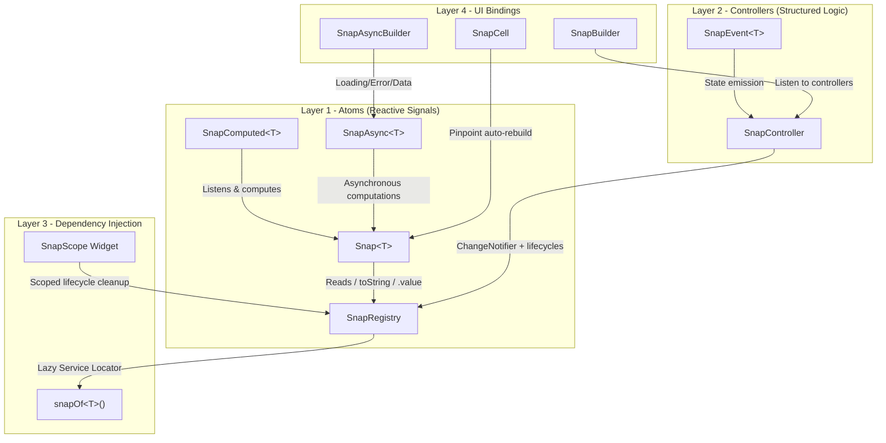

# SnapState


SnapState is a lightweight Flutter state-management package that combines reactive signals, controller-based UI updates, async derived state, and a and a scoped dependency registry.


It is designed for apps that want simple mutable state with fine-grained widget rebuilds, without forcing every read or mutation through `BuildContext`, `WidgetRef`, events, or generated code.
  

[](https://pub.dev/packages/snap_state)

[](https://opensource.org/licenses/MIT)


---
<p align="center">
  
</p>

## Installation
  
Add SnapState to your `pubspec.yaml`:

```yaml

dependencies:

  snap_state: ^1.0.0

```

Then import it:


```dart

import 'package:snap_state/snap_state.dart';

```
---

## Quick Example

```
final count = Snap<int>('count', 0);

SnapCell(
  builder: (_) => Text('${count.value}'),
);

```

Reads inside SnapCell automatically subscribe to updates.

---
without forcing every read or mutation through BuildContext, WidgetRef, events, or generated code
---

  ## Design Goals

| Goal | SnapState Approach |
|---|---|
| Fine-grained rebuilds | Reactive signals |
| Structured business logic | Controllers |
| Async state | Derived async pipelines |
| Dependency management | Scoped registry |
| Minimal boilerplate | Mutable reactive APIs |

## Why SnapState?

SnapState focuses on:
- Fine-grained reactive updates
- Mutable state ergonomics
- Scoped controller lifecycles
- Minimal setup overhead
- Async derived state handling

## What It Provides


| Feature | API | Purpose |

| :--- | :--- | :--- |

| Reactive state | `Snap<T>` | Store a value and rebuild only subscribed `SnapCell` widgets when it changes. |

| Derived state | `SnapComputed<T>` | Recompute synchronous values when dependencies change. |

| Async derived state | `SnapAsync<T>` | Run async work when dependencies change and expose loading/data/error states. |

| Controller updates | `SnapController` + `SnapBuilder<T>` | Keep structured business logic in a `ChangeNotifier`-based controller. |

| Dependency registry | `SnapRegistry`, `snapOf<T>()`, `SnapScope` | Register, inject, resolve, and dispose controllers. |

| Observability | `SnapObserver` | Track state changes, async errors, and controller lifecycle events. |

  
---


## Signals
  
Use `Snap<T>` for small pieces of reactive state. Reading `.value` inside a `SnapCell` automatically subscribes that widget to updates.

  

```dart

import 'package:flutter/material.dart';
import 'package:snap_state/snap_state.dart';

class CounterModule {

  final count = Snap<int>('counter_value', 0);


  late final isEven = SnapComputed<bool>(

    'is_even_computed',

    listen: [count],

    compute: () => count.value % 2 == 0,

  );


  void increment() => count.set(count.value + 1);

}


class SignalsCounterView extends StatelessWidget {

  SignalsCounterView({super.key});
  

  final module = CounterModule();

  @override

  Widget build(BuildContext context) {

    return Column(
      children: [
        SnapCell(
          builder: (context) {
            final parity = module.isEven.value ? 'even' : 'odd';
            return Text(
              'Count: ${module.count.value} '
              '($parity)',
            );
          },
        ),
        ElevatedButton(
         onPressed: module.increment,
          child: const Text('Increment'),
        ),
      ],
    );
  }

}

```
  

`Snap<T>` also overrides `toString()`, so string interpolation like `${module.count}` works. Use `.value` when you need the typed value.


---

## Controllers And DI


Use `SnapController` when a feature needs structured logic, lifecycle hooks, or multiple fields updated together.


Controllers can be registered manually with `SnapRegistry.instance.register(...)`, injected with `SnapScope`, and resolved with `snapOf<T>()`.


`SnapScope` creates the listed controllers when the scope is mounted and disposes those controller instances when the scope is removed. Internally, controllers are stored in a global registry keyed by type, so avoid registering two active controllers of the same type at the same time unless that is intentional.


```dart

import 'package:flutter/material.dart';
import 'package:snap_state/snap_state.dart';

class AuthController extends SnapController {
  String username = 'Guest';
  bool isLoggedIn = false;

  @override
  void onInit() {
    super.onInit();
    // Initialize controller state here.
  }

  @override
  void onReady() {
    super.onReady();
    // Called after the first frame when injected through SnapScope.
  }

  
  void login(String name) {
    username = name;
    isLoggedIn = true;
    update();
  }

  

  @override
  void onClose() {
    // Clean up subscriptions or streams here.
   super.onClose();
  }
}

  

class ProfileScreen extends StatelessWidget {
  const ProfileScreen({super.key}); 
  @override
  Widget build(BuildContext context) {
    return SnapScope(
      providers: [() => AuthController()],
      child: Scaffold(
        body: SnapBuilder<AuthController>(
          builder: (context, auth) {
            return Column(
              children: [
                Text('Welcome, ${auth.username}'),
                ElevatedButton(
                  onPressed: () {
                    snapOf<AuthController>().login('John Doe');
                  },
                  child: const Text('Login'),
                ),
              ],
            );
          },
        ),
      ),
    );
  }
}

```

  

You can also register a lazy factory:

  

```dart

void main() {

  SnapRegistry.instance.register<AuthController>(() => AuthController());
  runApp(const MyApp());
}

```

  

With manual registration, the controller is created the first time `snapOf<AuthController>()` is called.

  
---


## Async State


`SnapAsync<T>` listens to one or more dependencies and re-runs its async computation when they change. It stores an `AsyncValue<T>` state and uses an internal ticket counter so stale async responses do not overwrite newer results.


```dart

import 'package:flutter/material.dart';

import 'package:snap_state/snap_state.dart';
 

Future<int> fetchTemperature(String city) async {

  await Future<void>.delayed(const Duration(milliseconds: 500));

  return {'Mumbai': 32, 'London': 15}[city] ?? 25;

}
 

class WeatherController {

  final city = Snap<String>('city', 'Mumbai');

  final unit = Snap<String>('unit', 'C');

  late final weatherApi = SnapAsync<String>(

    'weather_pipeline',

    listen: [city, unit],

    compute: () async {

      final activeCity = city.value;

      final activeUnit = unit.value;

      final temp = await fetchTemperature(activeCity);

      return 'Weather in $activeCity: $temp degrees $activeUnit';

    },

  );

}

  

class WeatherView extends StatelessWidget {

  WeatherView({super.key});

  final controller = WeatherController();


  @override

  Widget build(BuildContext context) {
    return Column(
      children: [
        SnapAsyncBuilder<String>(
          snap: controller.weatherApi,
          loading: (context) => const CircularProgressIndicator(),
          error: (context, error) => Text('Error: $error'),
          data: (context, weather) => Text(weather),

        ),

        ElevatedButton(
          onPressed: () => controller.city.set('London'),
          child: const Text('Change to London'),

        ),

      ],

    );

  }

}

```

  

You can force a re-run with:

  

```dart

controller.weatherApi.refresh();

```


---
  

## Observability

  

Set a global `SnapObserver` to receive state mutations, async errors, and controller lifecycle events.
  

```dart

import 'package:flutter/material.dart';
import 'package:snap_state/snap_state.dart';
  
class AppAuditObserver implements SnapObserver {

  @override
  void onStateChange(String name, dynamic oldValue, dynamic newValue) {
    debugPrint('State changed: $name');
  }


  @override
  void onError(String name, Object error, StackTrace stackTrace) {
    debugPrint('Async error in $name: $error');
  }


  @override

  void onControllerCreated(Type controllerType) {

    debugPrint('Controller created: $controllerType');

  }


  @override

  void onControllerDisposed(Type controllerType) {

    debugPrint('Controller disposed: $controllerType');

  }

}

  

void main() {

  SnapRegistry.observer = AppAuditObserver();

  runApp(const MyApp());

}

```

  

---

  ## 🏗️ Architecture



---

## Notes

  

- `SnapCell` tracks `Snap`, `SnapComputed`, and `SnapAsync` reads performed during its builder.

- `SnapBuilder<T>` listens to a `SnapController` and rebuilds when `update()` is called.

- `SnapScope` manages controller disposal for the controller types it injects.

- `snapOf<T>()` resolves controllers from `SnapRegistry`; register a factory or inject the controller before resolving it.

- For typed logic, prefer `.value`; string interpolation is mainly a convenience for display.

  

---

  

## License

  

MIT